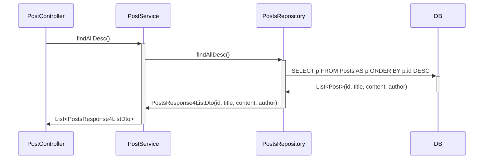
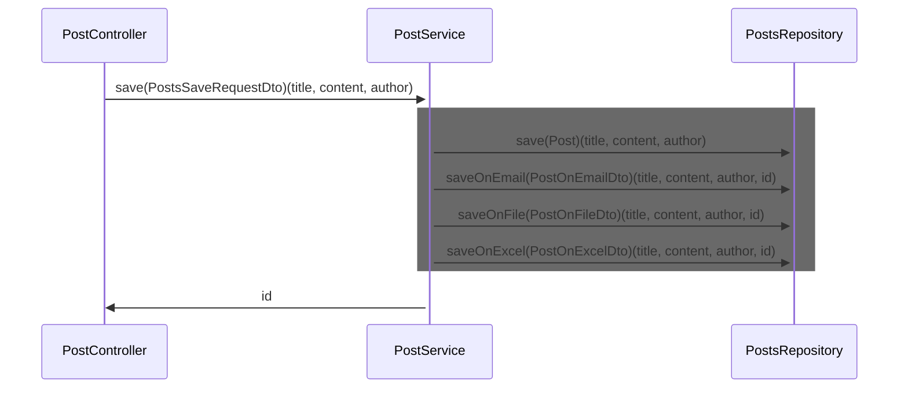
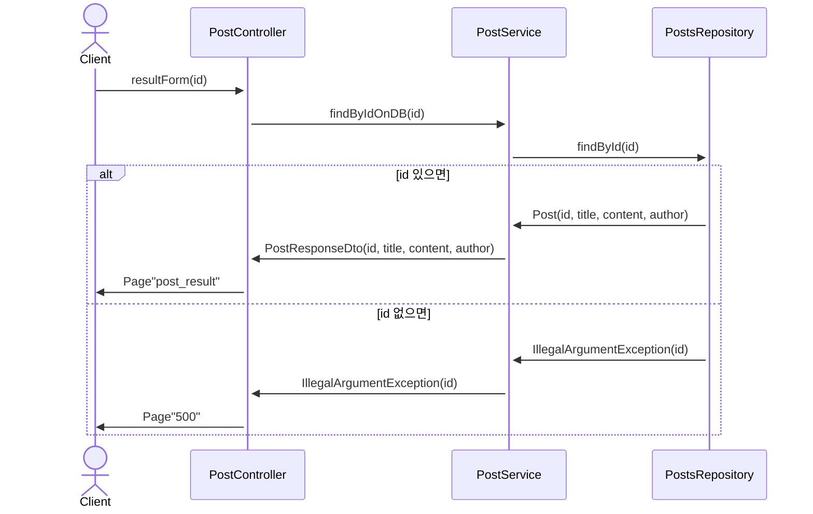
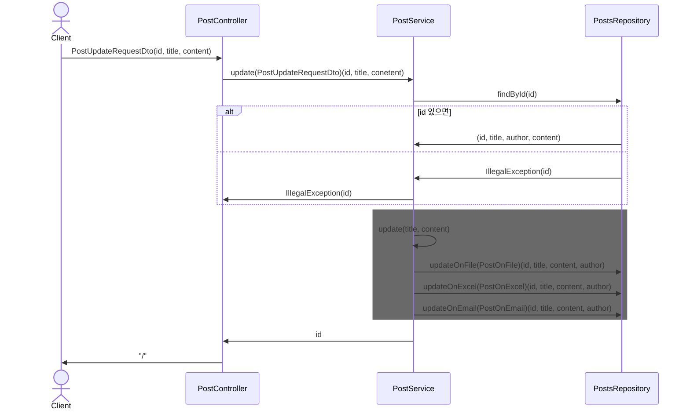
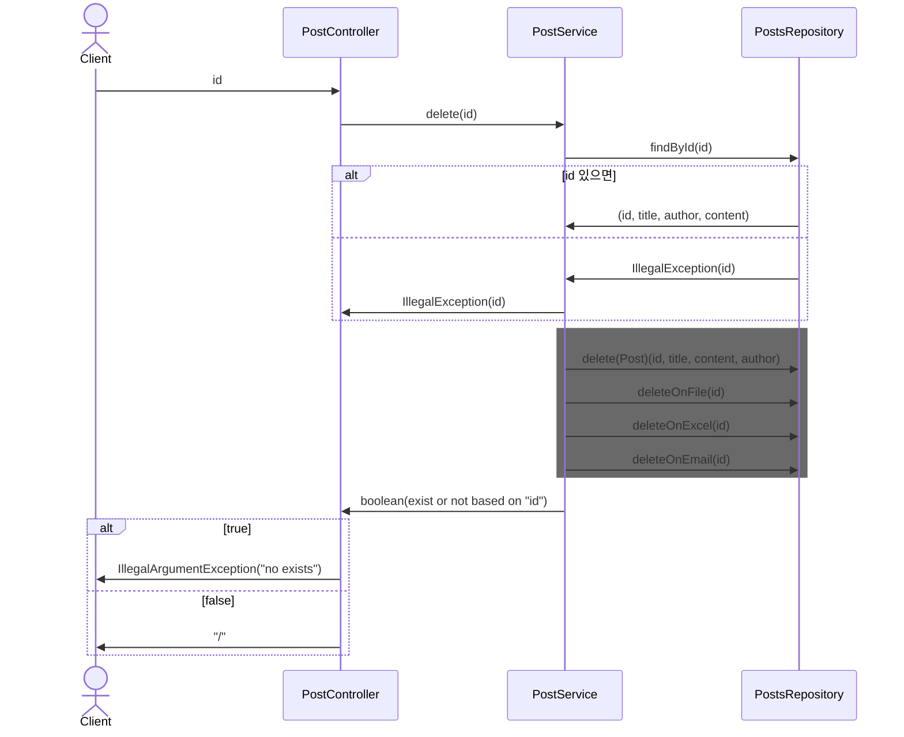

```mermaid
sequenceDiagram
participant C as PostController
participant S as PostService
participant R as PostsRepository
participant DB
C->>+S: findAllDesc()
S->>+R: findAllDesc()
R->>+DB: SELECT p FROM Posts AS p ORDER BY p.id DESC
DB->>-R:List<Post>(id, title, content, author)
R->>-S: PostsResponse4ListDto(id, title, content, author)
S->>-C: List<PostsResponse4ListDto>
```

```mermaid
sequenceDiagram
participant C as PostController
participant S as PostService
participant R as PostsRepository
C->>+S: save(PostsSaveRequestDto)(title, content, author)
%%db에 저장 안되면 사용자에게 에러
rect rgb(105,105,105)
S->>+R: save(Post)(title, content, author)
S->>+R: saveOnEmail(PostOnEmailDto)(title, content, author, id)
S->>+R: saveOnFile(PostOnFileDto)(title, content, author, id)
S->>+R: saveOnExcel(PostOnExcelDto)(title, content, author, id)
end
S->>C: id
%% 안쓰임
```

```mermaid
sequenceDiagram
actor Client
participant C as PostController
participant S as PostService
participant R as PostsRepository
Client->>+C: resultForm(id)
C->>+S: findByIdOnDB(id)
S->>+R: findById(id)
alt id 있으면
R->>S: Post(id, title, content, author)
S->>C: PostResponseDto(id, title, content, author)
C->>Client: Page"post_result"
else id 없으면
R->>S: IllegalArgumentException(id) 
%% 로깅 해야됨.
S->>C: IllegalArgumentException(id)
C->>Client: Page"500"
%%상황에 따라 보여질 500페이지 다듬어야 돼.
end
```

```mermaid
sequenceDiagram
actor Client
participant C as PostController
participant S as PostService
participant R as PostsRepository
Client->>C: PostUpdateRequestDto(id, title, content)
C->>S: update(PostUpdateRequestDto)(id, title, conetent)
S->>R: findById(id)
alt id 있으면
R->>S: (id, title, author, content)
else
R->>S: IllegalException(id)
S->>C: IllegalException(id)
end
rect rgb(105,105,105)
S->>S: update(title, content)
S->>R: updateOnFile(PostOnFile)(id, title, content, author)
S->>R: updateOnExcel(PostOnExcel)(id, title, content, author)
S->>R: updateOnEmail(PostOnEmail)(id, title, content, author)
end
S->>C: id
C->>Client: "/"
```

```mermaid
sequenceDiagram
actor Client
participant C as PostController
participant S as PostService
participant R as PostsRepository
Client->>C: id
C->>S: delete(id)
S->>R: findById(id)
alt id 있으면
R->>S: (id, title, author, content)
else
R->>S: IllegalException(id)
S->>C: IllegalException(id)
end
rect rgb(105,105,105)
S->>R: delete(Post)(id, title, content, author)
S->>R: deleteOnFile(id)
S->>R: deleteOnExcel(id)
S->>R: deleteOnEmail(id)
end
S->>C: boolean(exist or not based on "id")
alt true
C->>Client: IllegalArgumentException("no exists")
else false
C->>Client: "/"
end
```
