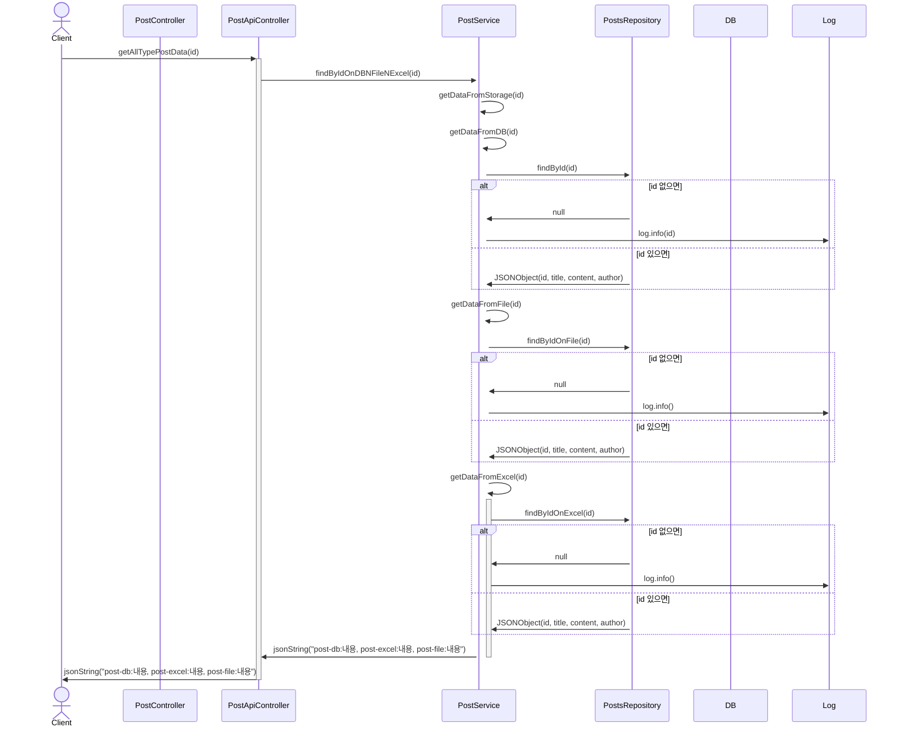
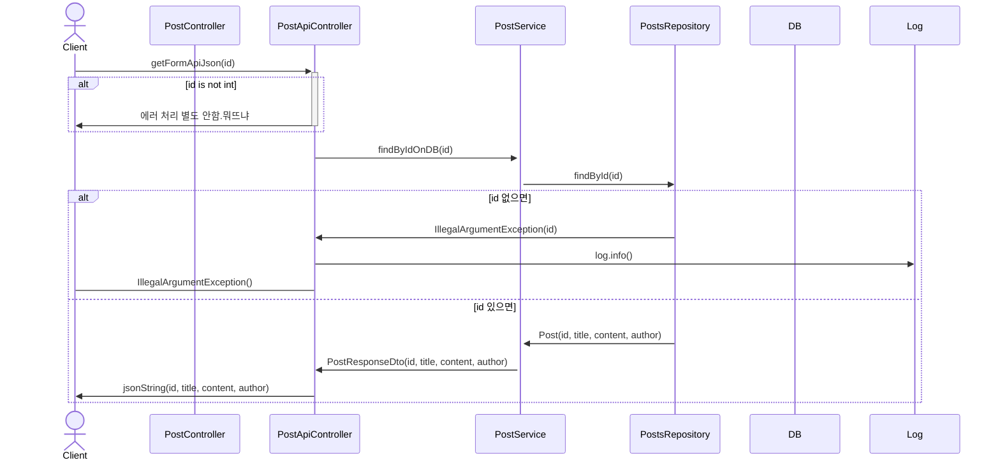
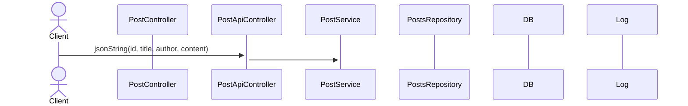

```mermaid
sequenceDiagram
actor Client
participant C as PostController
participant ApiC as PostApiController 
participant S as PostService
participant R as PostsRepository
participant DB
participant Log

Client->>+ApiC: getAllTypePostData(id)
ApiC->>+S: findByIdOnDBNFileNExcel(id)
S->>+S: getDataFromStorage(id)
%%findByIdOnXX -> getDataFromStorage, getData XX -> mergeDataFromStorage [rename]
S->>+S: getDataFromDB(id)
S->>+R: findById(id)
alt id 없으면
R->>S: null
S->>Log: log.info(id)
else id 있으면
R->>S: JSONObject(id, title, content, author)
end
S->>+S: getDataFromFile(id)
S->>+R: findByIdOnFile(id)
alt id 없으면
R->>S: null
S->>Log: log.info()
%%log 어케 남기지?
else id 있으면
R->>S: JSONObject(id, title, content, author)
end
S->>+S: getDataFromExcel(id)
S->>+R: findByIdOnExcel(id)
alt id 없으면
R->>S: null
S->>Log: log.info()
else id 있으면
R->>S: JSONObject(id, title, content, author)
end
S->>-ApiC: jsonString("post-db:내용, post-excel:내용, post-file:내용")
ApiC->>-Client: jsonString("post-db:내용, post-excel:내용, post-file:내용")
```

```mermaid
sequenceDiagram
actor Client
participant C as PostController
participant ApiC as PostApiController 
participant S as PostService
participant R as PostsRepository
participant DB
participant Log

Client->>+ApiC: getFormApiJson(id)
alt id is not int
ApiC->>-Client: 에러 처리 별도 안함.뭐뜨냐
%%log 해야 하는데
end
ApiC->>+S: findByIdOnDB(id)
S->>R: findById(id)
alt id 없으면
R->>ApiC: IllegalArgumentException(id)
ApiC->>Log: log.info()
ApiC->Client: IllegalArgumentException()
else id 있으면
R->>S: Post(id, title, content, author)
S->>ApiC:PostResponseDto(id, title, content, author)
ApiC->>Client: jsonString(id, title, content, author)
end
```

```mermaid
sequenceDiagram
actor Client
participant C as PostController
participant ApiC as PostApiController 
participant S as PostService
participant R as PostsRepository
participant DB
participant Log

Client->>+ApiC: jsonString(id, title, author, content)
ApiC->>+S: 

```