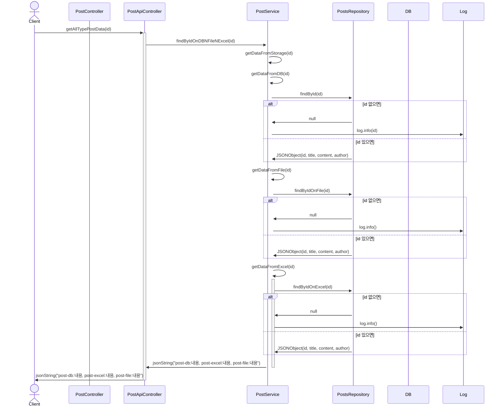
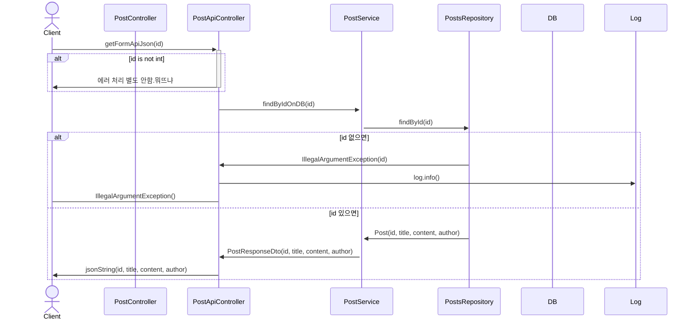
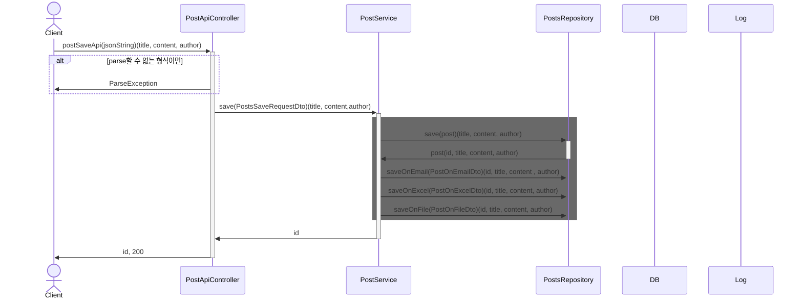
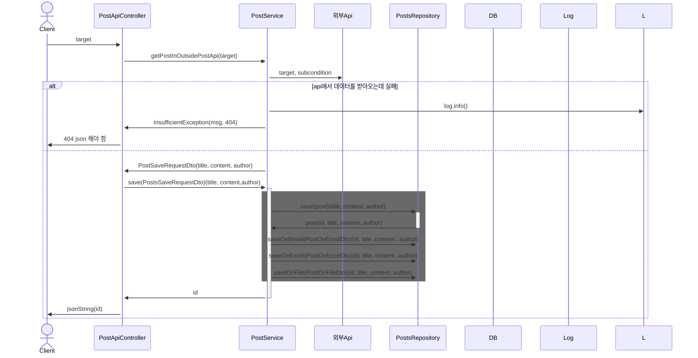

```mermaid
sequenceDiagram
actor Client
participant C as PostController
participant ApiC as PostApiController 
participant S as PostService
participant R as PostsRepository
participant DB
participant Log

Client->>+ApiC: getAllTypePostData(id)
ApiC->>+S: findByIdOnDBNFileNExcel(id)
S->>+S: getDataFromStorage(id)
%%findByIdOnXX -> getDataFromStorage, getData XX -> mergeDataFromStorage [rename]
S->>+S: getDataFromDB(id)
S->>+R: findById(id)
alt id 없으면
R->>S: null
S->>Log: log.info(id)
else id 있으면
R->>S: JSONObject(id, title, content, author)
end
S->>+S: getDataFromFile(id)
S->>+R: findByIdOnFile(id)
alt id 없으면
R->>S: null
S->>Log: log.info()
%%log 어케 남기지?
else id 있으면
R->>S: JSONObject(id, title, content, author)
end
S->>+S: getDataFromExcel(id)
S->>+R: findByIdOnExcel(id)
alt id 없으면
R->>S: null
S->>Log: log.info()
else id 있으면
R->>S: JSONObject(id, title, content, author)
end
S->>-ApiC: jsonString("post-db:내용, post-excel:내용, post-file:내용")
ApiC->>-Client: jsonString("post-db:내용, post-excel:내용, post-file:내용")
```

```mermaid
sequenceDiagram
actor Client
participant C as PostController
participant ApiC as PostApiController 
participant S as PostService
participant R as PostsRepository
participant DB
participant Log

Client->>+ApiC: getFormApiJson(id)
alt id is not int
ApiC->>-Client: 에러 처리 별도 안함.뭐뜨냐
%%log 해야 하는데
end
ApiC->>+S: findByIdOnDB(id)
S->>R: findById(id)
alt id 없으면
R->>ApiC: IllegalArgumentException(id)
ApiC->>Log: log.info()
ApiC->Client: IllegalArgumentException()
else id 있으면
R->>S: Post(id, title, content, author)
S->>ApiC:PostResponseDto(id, title, content, author)
ApiC->>Client: jsonString(id, title, content, author)
end
```

```mermaid
sequenceDiagram
actor Client
participant ApiC as PostApiController 
participant S as PostService
participant R as PostsRepository
participant DB
participant Log

Client->>+ApiC: postSaveApi(jsonString)(title, content, author)
alt parse할 수 없는 형식이면
ApiC->>Client: ParseException
%% 필요한 정보 없어도 parse error날리게 처리하셈
end
ApiC->>+S: save(PostsSaveRequestDto)(title, content,author)
rect rgb(105,105,105)
S->>+R: save(post)(title, content, author)
R->>-S: post(id, title, content, author)
S->>+R: saveOnEmail(PostOnEmailDto)(id, title, content , author)
S->>+R: saveOnExcel(PostOnExcelDto)(id, title, content, author)
S->>+R: saveOnFile(PostOnFileDto)(id, title, content, author)
end
S->>-ApiC: id
ApiC->>-Client: id, 200
```

```mermaid
sequenceDiagram
actor Client
participant ApiC as PostApiController 
participant S as PostService
participant A as 외부Api
participant R as PostsRepository
participant DB
participant Log

Client->>+ApiC: target
ApiC->>+S: getPostInOutsidePostApi(target)
S->>A: target, subcondition
alt api에서 데이터를 받아오는데 실패
S->>L: log.info()
S->>ApiC: InsufficientException(msg, 404)
ApiC->>Client: 404 json 해야 함
else 
S->>ApiC:PostSaveRequestDto(title, content, author)
ApiC->>+S: save(PostsSaveRequestDto)(title, content,author)
rect rgb(105,105,105)
S->>+R: save(post)(title, content, author)
R->>-S: post(id, title, content, author)
S->>+R: saveOnEmail(PostOnEmailDto)(id, title, content , author)
S->>+R: saveOnExcel(PostOnExcelDto)(id, title, content, author)
S->>+R: saveOnFile(PostOnFileDto)(id, title, content, author)
end
S->>-ApiC: id
ApiC->>Client: jsonString(id)

end
```